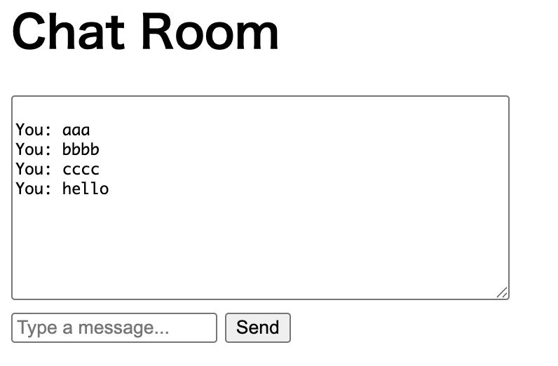

# local-chat-sample

local-chat-sample

FastAPI + WebSocket 聊天项目：

项目运行界面：



---

## 📡 WebSocket Chat with FastAPI

一个基于 FastAPI 和 WebSocket 的本地聊天室项目，支持多人实时通信，并带有简单的网页前端。适合学习 WebSocket、FastAPI 和前后端实时交互。

---

### 🚀 功能 Features

- 使用 WebSocket 实现实时通信
- 多用户聊天广播支持
- 简洁 HTML 前端界面
- FastAPI 提供后端服务和模板渲染
- 本地运行，适配 macOS / Windows / Linux

---

### 📦 安装 Installation

1. 克隆项目：

```bash
git clone https://github.com/your-username/websocket-chat-fastapi.git
cd websocket-chat-fastapi
```

2. 安装依赖（建议使用虚拟环境）：

```bash
pip install -r requirements.txt
```

---

### ▶️ 启动服务

使用 `uvicorn` 启动 FastAPI 应用：

```bash
uvicorn main:app --reload
```

浏览器访问：

```
http://localhost:8000
```

---

### 🖼 项目结构

```
websocket-chat-fastapi/
├── main.py                 # FastAPI 主服务
├── templates/
│   └── chat.html           # 聊天 HTML 页面
├── requirements.txt        # 项目依赖
├── .gitignore              # 忽略文件
└── README.md               # 项目说明
```

---

### 🛠 技术栈

- [FastAPI](https://fastapi.tiangolo.com/)
- [WebSocket](https://developer.mozilla.org/en-US/docs/Web/API/WebSocket)
- [Uvicorn](https://www.uvicorn.org/)
- HTML / JavaScript

---

### 📌 TODO（可选扩展）

- 用户昵称功能
- 聊天记录持久化（SQLite / Redis）
- 前端样式美化（使用 Bootstrap 或 TailwindCSS）
- 支持私聊 / 多房间

---

### 📄 License

本项目采用 [MIT License](LICENSE) 许可。

---
